# Universal MCP-TAO Agent

A **truly universal** AI agent that combines the power of multiple MCP (Model Context Protocol) servers with the intelligent TAO (Thought-Action-Observation) pattern. Unlike domain-specific agents, this agent can work with **ANY MCP servers** to perform **ANY tasks** across **ANY domain**.

## 🌟 Why "Universal"?

This agent is designed to be universally applicable:

- **🔧 Any MCP Servers**: Works with all types of MCP servers (npx, uvx, docker, podman, custom)
- **🎯 Any Domain**: Research, web automation, file operations, databases, APIs, code generation, and more
- **📋 Any Task**: Simple queries to complex multi-step workflows
- **🔄 Any Workflow**: Adapts intelligently to whatever tools are available

## 🚀 Core Features

### Multi-MCP Integration
- **FastMCP-Powered**: Zero async warnings, superior reliability
- **Wellknown Configuration**: Standard JSON format used by Claude Desktop and VS Code
- **Parallel Connections**: Connects to multiple servers simultaneously
- **Graceful Degradation**: Works even if some servers fail
- **Tool Aggregation**: Unified interface for tools from all servers

### TAO Pattern Intelligence
- **🧠 Think**: Analyzes problems and available tools intelligently
- **⚡ Act**: Executes appropriate actions using the best available tools
- **👁️ Observe**: Learns from results to improve subsequent actions
- **🔄 Loop**: Continues until the problem is solved or goals are met

### Universal Capabilities
- **Dynamic Tool Discovery**: Automatically finds and uses available tools
- **Smart Parameter Mapping**: Intelligently maps inputs to tool requirements
- **Cross-Domain Reasoning**: Combines tools from different domains when needed
- **Adaptive Workflows**: Adjusts strategy based on available capabilities

## 🎯 Use Cases

This agent can handle virtually any task where MCP tools are available:

### Research & Information
- Multi-source research combining web search, documentation, and databases
- Fact-checking across multiple information sources
- Literature reviews and data synthesis

### Web & Automation
- Complex web scraping workflows
- Browser automation sequences
- API integration and data collection

### Development & Code
- Code generation with testing and validation
- Multi-step deployment workflows
- Documentation generation and maintenance

### Data & Analysis
- Data collection from multiple sources
- ETL pipeline execution
- Report generation with visualizations

### Content & Media
- Multi-modal content creation
- Image processing and manipulation
- Document conversion and formatting

### System & Operations
- File system operations and management
- Configuration management
- Monitoring and alerting workflows

## 📁 Project Structure

```
agents/mcp-tao/
├── main.py                 # 🚀 Main application entry point
├── flow.py                 # 🔄 Universal TAO flow implementation  
├── nodes.py                # 🧠 Universal TAO nodes (Think, Act, Observe, End)
├── utils_fastmcp.py        # ⚡ FastMCP client utilities
├── mcp_config.py           # ⚙️ Configuration parser
├── auto_detect_config.py   # 🔍 Auto-configuration generator
├── mcp_servers.json        # 📋 Server configuration
├── requirements.txt        # 📦 Dependencies
└── README.md              # 📖 This documentation
```

## 🛠️ Quick Start

### Prerequisites

Install the required tools for your MCP servers:
- **NPX servers**: Node.js and npm
- **UVX servers**: [uv](https://docs.astral.sh/uv/) package manager  
- **Container servers**: [Docker](https://docs.docker.com/get-docker/) or [Podman](https://podman.io/)

### Installation

1. Install dependencies:
```bash
pip install -r requirements.txt
```

2. Set your LLM configuration:
```bash
export OPENAI_API_KEY="your-api-key-here"
export OPENAI_MODEL="gpt-4o"  # or your preferred model
export OPENAI_BASE_URL="https://api.openai.com/v1"  # optional
```

3. Configure your MCP servers (see Configuration section)

### Running the Agent

```bash
# Interactive mode
python main.py

# Direct query
python main.py "Can you help me research and analyze the latest developments in quantum computing?"

# Complex workflow
python main.py "Navigate to example.com, take a screenshot, then analyze the page content and provide insights"

# Multi-domain task
python main.py "Search for Python tutorials, save the best ones to a file, then create a learning plan"
```

## ⚙️ Configuration

### MCP Server Configuration

Configure MCP servers in `mcp_servers.json` using the wellknown format:

```json
{
  "mcpServers": {
    "web-fetch": {
      "type": "stdio",
      "command": "uvx",
      "args": ["mcp-server-fetch"]
    },
    "browser-automation": {
      "type": "stdio", 
      "command": "docker",
      "args": ["run", "-i", "--rm", "mcp/playwright"]
    },
    "advanced-reasoning": {
      "type": "stdio",
      "command": "npx",
      "args": ["-y", "@modelcontextprotocol/server-sequential-thinking"]
    },
    "file-operations": {
      "type": "stdio",
      "command": "uvx",
      "args": ["mcp-server-filesystem"]
    },
    "database-tools": {
      "type": "stdio",
      "command": "npx",
      "args": ["-y", "mcp-server-sqlite"]
    }
  }
}
```

### Auto-Configuration

Generate optimal configuration for your system:
```bash
python auto_detect_config.py
```

### Adding New Servers

1. Add server to `mcp_servers.json`:
```json
{
  "mcpServers": {
    "your-new-server": {
      "type": "stdio",
      "command": "your-command",
      "args": ["your", "args"]
    }
  }
}
```

2. Restart the agent - it automatically discovers new tools!

## 🔄 How It Works

### TAO Flow Architecture

```mermaid
flowchart TD
    Start([Start]) --> Think[🧠 Think Node]
    Think -->|analyze tools & decide action| Action[⚡ Action Node]
    Think -->|ready for final answer| End[🏁 End Node]
    Action -->|execute tool| Observe[👁️ Observe Node]
    Observe -->|analyze results| Think
    End --> Success([Success])
```



### Intelligent Decision Making

1. **Think Phase**: 
   - Analyzes the user query
   - Reviews available tools from ALL connected servers
   - Considers previous observations
   - Decides on the best next action

2. **Action Phase**:
   - Executes the chosen tool with appropriate parameters
   - Handles any tool from any server seamlessly
   - Provides robust error handling

3. **Observe Phase**:
   - Analyzes the action results
   - Extracts key insights and information
   - Identifies what was learned or accomplished

4. **Loop or Complete**:
   - Continues the cycle if more work is needed
   - Provides final answer when the goal is achieved

### Universal Tool Integration

The agent automatically adapts to whatever tools are available:

- **Dynamic Discovery**: Finds all tools from all connected servers
- **Smart Matching**: Matches user needs to appropriate tools
- **Parameter Mapping**: Intelligently maps inputs to tool requirements
- **Cross-Server Workflows**: Combines tools from different servers when beneficial

## 🌐 Example Workflows

### Research Workflow
```
Query: "Research the latest trends in sustainable energy and create a summary"

Think: Need to gather information about sustainable energy trends
Action: web_search("latest sustainable energy trends 2024")
Observe: Found current trends including solar, wind, and battery technology

Think: Need more specific data on recent developments  
Action: fetch_url("https://sustainable-energy-report.com/2024")
Observe: Retrieved detailed report with statistics and projections

Think: Should create a structured summary
Action: create_document("sustainable_energy_summary.md", formatted_content)
Observe: Document created successfully

Final Answer: [Comprehensive summary of sustainable energy trends]
```

### Web Automation Workflow
```
Query: "Take a screenshot of example.com and analyze its design"

Think: Need to navigate to the website and capture it
Action: navigate_to("https://example.com")
Observe: Successfully loaded the website

Think: Now need to take a screenshot
Action: take_screenshot("example_com_screenshot.png")
Observe: Screenshot captured and saved

Think: Should analyze the design elements
Action: analyze_image("example_com_screenshot.png", "analyze web design")
Observe: Identified key design elements, layout, and user experience aspects

Final Answer: [Detailed design analysis with specific observations]
```

### Multi-Domain Workflow
```
Query: "Find Python learning resources, evaluate them, and create a study plan"

Think: Need to search for Python learning resources
Action: web_search("best Python learning resources 2024")
Observe: Found various tutorials, courses, and documentation

Think: Should evaluate the quality of these resources
Action: fetch_multiple_urls(resource_urls)
Observe: Retrieved content from top resources

Think: Need to analyze and rank the resources
Action: analyze_content(resources, "evaluate for beginner Python learning")
Observe: Identified strengths and weaknesses of each resource

Think: Should create a structured study plan
Action: create_study_plan(evaluated_resources, "8-week Python learning plan")
Observe: Generated comprehensive study plan with timeline

Final Answer: [Detailed study plan with ranked resources and timeline]
```

## 🔧 Extending the Agent

### Adding Custom Nodes

Create specialized nodes for specific domains:

```python
class AsyncCustomNode(AsyncNode):
    async def prep(self, shared):
        # Prepare custom logic
        pass
    
    async def exec(self, prep_res):
        # Execute custom functionality
        pass
    
    async def post(self, shared, prep_res, exec_res):
        # Post-process and decide next step
        pass
```

### Custom Tool Filtering

Filter tools based on context or requirements:

```python
def filter_tools_by_context(available_tools, context):
    filtered = {}
    for server, tools in available_tools.items():
        relevant_tools = [
            tool for tool in tools 
            if matches_context(tool, context)
        ]
        if relevant_tools:
            filtered[server] = relevant_tools
    return filtered
```

### Parallel Tool Execution

Execute multiple tools simultaneously:

```python
async def execute_parallel_tools(tools, inputs):
    tasks = [
        mcp_client.call_tool(server, tool, params)
        for server, tool, params in zip(tools, inputs)
    ]
    results = await asyncio.gather(*tasks, return_exceptions=True)
    return results
```

## 🐛 Troubleshooting

### Server Connection Issues

1. **Check prerequisites**:
```bash
which node  # for npx servers
which uv    # for uvx servers  
which docker # for docker servers
which podman # for podman servers
```

2. **Validate configuration**:
```bash
python mcp_config.py
```

3. **Test individual servers**:
```bash
python utils_fastmcp.py
```

### Common Issues

- **"No tools available"**: Check that at least one server connected successfully
- **"Tool execution failed"**: Verify tool parameters match expected schema
- **"Server failed to start"**: Ensure required packages/containers are available
- **Connection timeouts**: Some servers may need longer startup time

### Debug Mode

Enable detailed logging:
```python
import logging
logging.basicConfig(level=logging.DEBUG)
```

## 🎯 Best Practices

### Configuration
- Start with reliable, well-tested MCP servers
- Use auto-detection for optimal container runtime selection
- Test new servers individually before adding to production config

### Queries
- Be specific about your goals and requirements
- Provide context when asking for complex multi-step workflows
- Break down very large tasks into smaller, focused queries

### Tool Integration
- Ensure tool dependencies are properly installed
- Keep MCP server packages/containers up to date
- Monitor server performance and connection stability

## 🤝 Contributing

Contributions welcome! Areas for improvement:

1. **New MCP Server Support**: Add configuration for additional servers
2. **Enhanced Tool Discovery**: Improve automatic tool categorization
3. **Workflow Optimization**: Better decision making for tool selection
4. **Error Recovery**: More robust handling of server failures
5. **Performance**: Optimizations for large-scale deployments

## 📚 Learn More

- [PocketFlow Documentation](https://the-pocket.github.io/PocketFlow/)
- [Model Context Protocol Specification](https://spec.modelcontextprotocol.io/)
- [FastMCP Library](https://github.com/pydantic/fastmcp)
- [MCP Server Registry](https://github.com/modelcontextprotocol/servers)

## 📄 License

This agent follows the same license as the parent PocketFlow project.

---

**🌟 The Universal MCP-TAO Agent: Where ANY tools meet intelligent workflows** 🌟