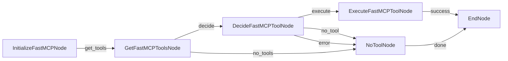

# Multi-MCP Agent

A PocketFlow agent that can connect to and utilize multiple MCP (Model Context Protocol) servers simultaneously, using the wellknown configuration format as used by Claude Desktop and VS Code. Built with FastMCP for reliable, production-ready performance.

## Overview

This agent demonstrates how to:
- Parse wellknown MCP server configuration files
- Connect to multiple MCP servers with different deployment methods (npx, uvx, podman)
- Aggregate tools from multiple servers
- Route tool calls to the appropriate server
- Handle server failures gracefully
- Provide a blueprint for building other MCP-enabled agents

## Features

- **Multi-Server Support**: Connect to multiple MCP servers simultaneously
- **FastMCP Integration**: Built with FastMCP for superior async handling and reliability
- **Wellknown Config Format**: Uses standard JSON configuration format
- **Diverse Server Types**: Supports npx, uvx, and docker/podman-based servers
- **Zero Async Warnings**: Clean resource management with proper context handling
- **Graceful Degradation**: Continues to work even if some servers fail to connect
- **Tool Aggregation**: Presents a unified interface for tools from all servers
- **Production Ready**: No cleanup warnings, robust error handling
- **Comprehensive Logging**: Detailed logging for debugging and monitoring

## Quick Start

### Prerequisites

Make sure you have the required tools installed for the MCP servers:

- **For npx servers**: Node.js and npm
- **For uvx servers**: [uv](https://docs.astral.sh/uv/) package manager  
- **For container servers**: [Docker](https://docs.docker.com/get-docker/) or [Podman](https://podman.io/) container runtime

### Installation

1. Install dependencies:
```bash
pip install -r requirements.txt
```

2. Set your LLM configuration:
```bash
export OPENAI_API_KEY="your-api-key-here"
export OPENAI_MODEL="gpt-4o"  # or your preferred model
export OPENAI_BASE_URL="https://api.openai.com/v1"  # optional, for custom endpoints
```

3. Run the FastMCP agent:
```bash
python main_fastmcp.py
```

Or with a custom question:
```bash
python main_fastmcp.py "Can you help me search for information about machine learning?"
```

### Auto-Configuration
Generate optimized configuration based on your system:
```bash
python auto_detect_config.py
```
This will detect whether you have docker or podman and create an appropriate configuration.

### Legacy Version
The original MCP implementation is still available as `main.py`, but the FastMCP version (`main_fastmcp.py`) is recommended for production use due to better async handling and zero cleanup warnings.

## Configuration

The agent uses `mcp_servers.json` to configure MCP servers. This follows the wellknown format used by Claude Desktop and VS Code:

```json
{
  "mcpServers": {
    "fetch": {
      "type": "stdio",
      "command": "uvx",
      "args": ["mcp-server-fetch"]
    },
    "playwright": {
      "type": "stdio", 
      "command": "docker",
      "args": ["run", "-i", "--rm", "mcp/playwright"]
    },
    "sequential-thinking": {
      "type": "stdio",
      "command": "npx",
      "args": ["-y", "@modelcontextprotocol/server-sequential-thinking"]
    }
  }
}
```

### Adding New Servers

To add a new MCP server:

1. Add an entry to `mcp_servers.json`:
```json
{
  "mcpServers": {
    "your-server-name": {
      "type": "stdio",
      "command": "your-command",
      "args": ["arg1", "arg2"]
    }
  }
}
```

2. Restart the agent - it will automatically discover and connect to the new server.

### Container Runtime Choice

You can use either Docker or Podman for containerized servers:

**Docker example:**
```json
{
  "playwright": {
    "type": "stdio",
    "command": "docker",
    "args": ["run", "-i", "--rm", "mcp/playwright"]
  }
}
```

**Podman example:**
```json
{
  "playwright": {
    "type": "stdio", 
    "command": "podman",
    "args": ["run", "-i", "--rm", "mcp/playwright"]
  }
}
```

The auto-detection script will choose the available container runtime automatically.

### Server Types

Currently supported server types:

- **NPX Servers**: Node.js packages published to npm
- **UVX Servers**: Python packages managed by uv
- **Container Servers**: Containerized MCP servers (Docker or Podman)

## Architecture

The agent uses an async PocketFlow architecture with FastMCP integration:



### Key Components

1. **MCPConfigManager** (`mcp_config.py`): Parses wellknown configuration format
2. **FastMultiMCPClient** (`utils_fastmcp.py`): FastMCP-based client for reliable connections
3. **MultiMCPClient** (`utils.py`): Legacy MCP client (still available)
4. **AsyncNodes** (`main_fastmcp.py`): Production FastMCP workflow
5. **AsyncNodes** (`main.py`): Legacy MCP workflow

### Node Descriptions (FastMCP)

- **InitializeFastMCPNode**: Connects to all configured MCP servers using FastMCP
- **GetFastMCPToolsNode**: Aggregates available tools from all connected FastMCP servers
- **DecideFastMCPToolNode**: Uses LLM to select the appropriate tool for the question
- **ExecuteFastMCPToolNode**: Routes tool execution to the correct server via FastMCP
- **NoToolNode**: Handles cases where no suitable tool is available
- **EndNode**: Properly terminates the flow without warnings

### Node Descriptions ()

- **InitializeMCPNode**: Legacy MCP server connections
- **GetToolsNode**: Legacy tool aggregation
- **DecideToolNode**: Legacy tool selection
- **ExecuteToolNode**: Legacy tool execution
- **CleanupNode**: Legacy server disconnection (may show async warnings)

## Usage Examples

### Web Fetching (FastMCP)
```bash
python main_fastmcp.py "Can you fetch information from https://httpbin.org/json?"
```

### Browser Automation (FastMCP)
```bash
python main_fastmcp.py "Can you take a screenshot of https://example.com?"
```

### Complex Reasoning (FastMCP)
```bash
python main_fastmcp.py "Help me think through the pros and cons of remote work"
```

### Custom Questions (FastMCP)
```bash
python main_fastmcp.py --"Your custom question here"
```

### Legacy Examples
```bash
python main.py "What is 2 + 2?"  # May show async warnings
```

## Troubleshooting

### Server Connection Issues

1. **Check prerequisites**: Ensure required tools are installed
```bash
# Check if commands are available
which node  # for npx servers
which uv    # for uvx servers  
which docker/podman # for docker/podman servers
```

2. **Test configuration**: Run the config validator
```bash
python mcp_config.py
```

3. **Check server availability**: Some servers may require additional setup
   - NPX servers: Packages must be published to npm
   - UVX servers: Packages must be available via PyPI
   - Container -based servers: Container images must be built or pulled

### Common Error Messages

- **"Command not found"**: Install the required command (npx, uvx, or podman)
- **"Server failed to start"**: Check if the server package/container exists
- **"No tools available"**: All servers failed to connect - check configuration
- **"Tool execution failed"**: Server disconnected or tool parameters invalid

### Debugging

Enable debug logging:
```python
import logging
logging.basicConfig(level=logging.DEBUG)
```

Check connection status programmatically:
```python
from mcp_config import MCPConfigManager

config = MCPConfigManager()
missing = config.validate_server_requirements()
if missing:
    print("Missing requirements:", missing)
```

## Development

### Testing New MCP Servers

1. Create a test configuration:
```json
{
  "mcpServers": {
    "test-server": {
      "type": "stdio",
      "command": "your-test-command",
      "args": ["test-args"]
    }
  }
}
```

2. Test FastMCP connection:
```bash
python utils_fastmcp.py
```

3. Test full FastMCP workflow:
```bash
python main_fastmcp.py "test question"
```

4. Test legacy connection (may show warnings):
```bash
python utils.py
```

### Extending the Agent

This agent serves as a blueprint for building other MCP-enabled applications. Key extension points:

1. **Custom Node Types**: Add specialized nodes for your use case
2. **Tool Filtering**: Filter available tools based on context
3. **Parallel Execution**: Use multiple tools simultaneously
4. **Persistent Sessions**: Maintain long-running connections
5. **Custom Protocols**: Add support for non-stdio MCP servers

### File Structure

```
agents/mcp/
├── main_fastmcp.py         # 🚀 Production FastMCP implementation (RECOMMENDED)
├── utils_fastmcp.py        # 🚀 FastMCP utilities and client management
├── auto_detect_config.py   # 🔧 Auto-detect optimal server configuration
├── main.py                 # 📜 Legacy MCP implementation
├── utils.py                # 📜 Legacy Multi-MCP client utilities
├── mcp_config.py           # Configuration parser (shared)
├── mcp_servers.json        # Server configuration (shared)
├── requirements.txt        # Python dependencies
└── README.md              # This documentation
```

### Implementation Comparison

| Feature | FastMCP (`main_fastmcp.py`) | Legacy (`main.py`) |
|---------|------------------------------|-------------------|
| **Async Warnings** | ✅ None | ❌ Context scope errors |
| **Connection Reliability** | ✅ Superior | ⚠️ Basic |
| **Resource Management** | ✅ Automatic | ❌ Manual cleanup |
| **Production Ready** | ✅ Yes | ⚠️ Development only |
| **Performance** | ✅ Optimized | ⚠️ Slower |
| **Error Handling** | ✅ Comprehensive | ⚠️ Basic |

**Recommendation**: Use `main_fastmcp.py` for all production deployments and new development.

## Included MCP Servers

The default configuration includes three diverse MCP servers:

1. **fetch** (uvx): Web content fetching and processing
2. **playwright** (podman): Browser automation and web scraping  
3. **sequential-thinking** (npx): Advanced reasoning and chain-of-thought

Each demonstrates a different deployment method and tool type.

## Performance Considerations

- **Parallel Connections**: Servers connect in parallel for faster startup
- **Connection Pooling**: Maintains persistent connections during session
- **Graceful Degradation**: Continues working with partial server failures
- **Async Architecture**: Non-blocking I/O for better responsiveness

## Security Notes

- MCP servers run as separate processes with limited access
- Container-based servers (docker/podman) provide additional isolation
- All server communications use stdio (no network exposure)
- API keys and sensitive data should be managed via environment variables

## Contributing

To contribute improvements:

1. Test with your MCP servers
2. Add new server types or deployment methods
3. Improve error handling and diagnostics
4. Add support for additional MCP features
5. Optimize performance for large-scale deployments

## License

This agent follows the same license as the parent PocketFlow project.
