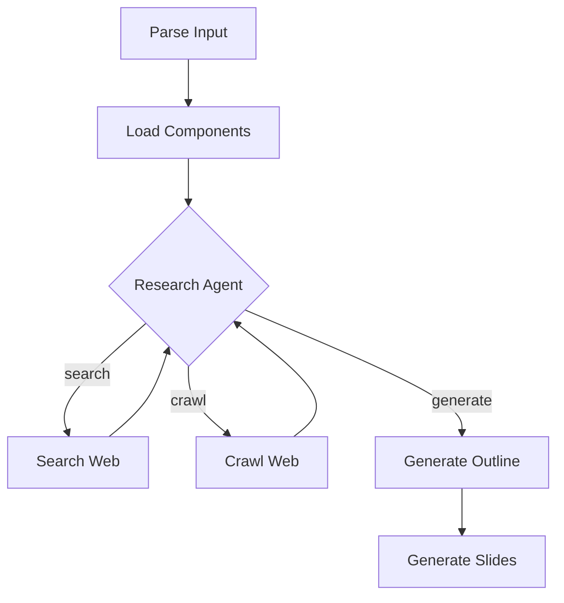

# Design Doc: Slidev Assistant

> Please DON'T remove notes for AI

## Requirements

> Notes for AI: Keep it simple and clear.
> If the requirements are abstract, write concrete user stories

The Slidev Assistant creates professional Slidev presentations from simple text descriptions. Users provide:
- A text file describing presentation topic, tone, and content requirements
- Optional specific slide requests with detailed descriptions
- The system researches content via web search and crawling
- Generated presentations utilize custom components and full Slidev capabilities

**User Stories:**
1. "I have a presentation.txt describing my AI fails talk - generate a 10-slide presentation with a funny, exaggerated tone"
2. "Research the latest AI security breaches and create slides using the nuclear hacker theme"
3. "Generate slides about a technical topic with proper code examples and interactive components"

## Flow Design

> Notes for AI:
> 1. Consider the design patterns of agent, map-reduce, rag, and workflow. Apply them if they fit.
> 2. Present a concise, high-level description of the workflow.

### Applicable Design Pattern:

**Agent Pattern**: Research agent decides when to search web, crawl URLs, or proceed to generation based on content needs.

**Workflow Pattern**: Sequential processing of input → research → outline → generation with agent-based research loop.

### Flow High-level Design:

1. **Parse Input Node**: Extract title, tone, content requirements, and specific slide requests from presentation.txt
2. **Load Components Node**: Parse available custom components from demo.md and standard Slidev capabilities from slides.md
3. **Research Agent Node**: Intelligently decide whether to search web, crawl specific URLs, or proceed to generation
4. **Search Web Node**: Perform DuckDuckGo searches for additional content
5. **Crawl Web Node**: Extract detailed content from relevant URLs
6. **Generate Outline Node**: Create structured slide outline with component usage
7. **Generate Slides Node**: Produce final Slidev markdown with custom components



## Utility Functions

> Notes for AI:
> 1. Understand the utility function definition thoroughly by reviewing the doc.
> 2. Include only the necessary utility functions, based on nodes in the flow.

1. **Call LLM** (`utils/call_llm.py`)
   - *Input*: prompt (str), messages (list, optional)
   - *Output*: response (str)
   - Used by research agent, outline generation, and slide generation nodes
   - Connects to DeepSeek via OpenRouter using settings from llm.env

2. **Search Web** (`utils/search_web.py`)
   - *Input*: query (str), max_results (int, optional)
   - *Output*: list of search results with title, link, snippet
   - Used by SearchWebNode for DuckDuckGo searches
   - Based on duckduckgo-search library patterns

3. **Web Crawler** (`utils/web_crawler.py`)
   - *Input*: url (str), delay_after_load (int, optional)
   - *Output*: (clean_text, links) tuple
   - Already implemented using crawl4ai
   - Used by CrawlWebNode for detailed content extraction

4. **Parse Components** (`utils/parse_components.py`)
   - *Input*: demo_content (str), slides_content (str)
   - *Output*: dict with available_components and capabilities
   - Extracts custom components (Terminal, Warning) and standard Slidev features
   - Used by LoadComponentsNode to understand available presentation elements

## Node Design

### Shared Store

> Notes for AI: Try to minimize data redundancy

The shared store structure is organized as follows:

```python
shared = {
    "input": {
        "title": "str - presentation title",
        "tone": "str - presentation tone/style",
        "content": "str - main content description",
        "slides": "list - specific slide requests"
    },
    "research": {
        "search_results": "list - web search results",
        "crawled_content": "dict - URL to content mapping",
        "research_complete": "bool - whether research phase is done"
    },
    "components": {
        "available_components": "list - custom components with usage",
        "slidev_capabilities": "str - standard Slidev features"
    },
    "generated": {
        "outline": "dict - structured slide outline",
        "slides": "str - final Slidev markdown"
    }
}
```

### Node Steps

> Notes for AI: Carefully decide whether to use Batch/Async Node/Flow.

1. **ParseInputNode**
   - *Purpose*: Extract presentation requirements from input text file
   - *Type*: Regular
   - *Steps*:
     - *prep*: Read file path from shared store input
     - *exec*: Parse text file extracting title, tone, content, slides
     - *post*: Write parsed data to shared["input"]

2. **LoadComponentsNode**
   - *Purpose*: Extract available components and Slidev capabilities
   - *Type*: Regular
   - *Steps*:
     - *prep*: Read demo.md and slides.md file paths
     - *exec*: Call parse_components utility to extract components
     - *post*: Write components data to shared["components"]

3. **ResearchAgentNode**
   - *Purpose*: Decide next action based on current research state
   - *Type*: Regular
   - *Steps*:
     - *prep*: Read input requirements and current research state
     - *exec*: Call LLM to decide: search, crawl, or generate
     - *post*: Return action string ("search", "crawl", "generate")

4. **SearchWebNode**
   - *Purpose*: Perform web searches for additional content
   - *Type*: Regular
   - *Steps*:
     - *prep*: Read search terms from agent decision
     - *exec*: Call search_web utility
     - *post*: Add results to shared["research"]["search_results"]

5. **CrawlWebNode**
   - *Purpose*: Extract detailed content from specific URLs
   - *Type*: Regular
   - *Steps*:
     - *prep*: Read URLs from agent decision or search results
     - *exec*: Call web_crawler utility
     - *post*: Add content to shared["research"]["crawled_content"]

6. **GenerateOutlineNode**
   - *Purpose*: Create structured presentation outline
   - *Type*: Regular
   - *Steps*:
     - *prep*: Read input requirements, research data, and components
     - *exec*: Call LLM to generate structured outline
     - *post*: Write outline to shared["generated"]["outline"]

7. **GenerateSlidesNode**
   - *Purpose*: Generate final Slidev markdown presentation
   - *Type*: Regular
   - *Steps*:
     - *prep*: Read outline, components, and research data
     - *exec*: Call LLM to generate Slidev markdown with custom components
     - *post*: Write final slides to shared["generated"]["slides"]

