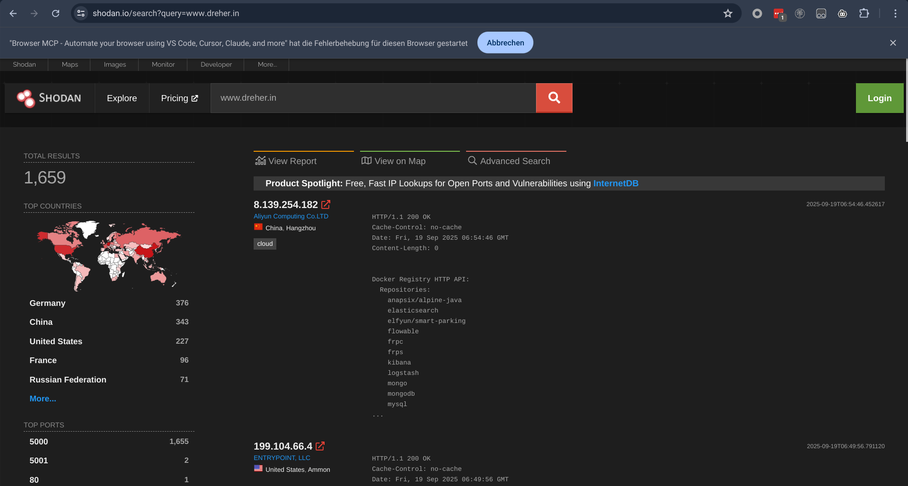

---
layout: cover
---

# <span class="radioactive">Computer Kill Flanders</span> in 2025
## Homer's Revenge: Exploring Offensive AI Use Cases

<div class="mt-8 text-green-400 font-mono">
MCTTP Munich Cyber Tactics, Techniques & Procedurese 2025
</div>

<div class="mt-12">
  <div class="text-sm text-gray-400 font-mono mb-4">
    Christopher Bleckmann-Dreher <span class="d-oh">@schniggie</span>
  </div>
</div>


---
layout: terminal
---

# preliminary skirmish

- Me: Christopher, 15+ years offensive, self-hoster, tech nerd
- Talk: No theory/math about AI (GPT, Transformers, etc.)
- Opinion: I see AI a tool, no discussion about AI revolution here


---
transition: fade-out
---

# Explorer of the Internet



---
transition: fade-out
---

# Explorer of the Internet
Source: https://www.zdnet.com/article/researcher-prints-pwned-on-hundreds-of-gps-watches-maps-due-to-unfixed-api/


---
transition: fade-out
---

# How I got here?
## Or why security people are so afraid of AI?

<div class="text-center space-y-8 mt-12">

<div class="text-4xl radioactive">☢️ I have to admit I LOVE AI ☢️</div>


</div>


---
transition: fade-out
layout: center
---

# The Beginning
<Tweet id="1598038815599661056" scale="1.00" />

---
transition: fade-out
layout: intro
---

# MCTTP Hands Up
### How much AI is this room?

<div class="text-center space-y-8 mt-12">

<div v-click=1>NO AI at all. Fuck off Skynet.</div>
<div v-click=2>WEEKLY: ChatGPT and other chatbots ?</div>
<div v-click=3>DAILY: ChatGPT and other chatbots ?</div>
<div v-click=4>Copilots: Github, Office365, ... ?</div>
<div v-click=5>Already all in on Agentic (Inferencing, Tool Calling, Agentic Patterns)</div>

</div>


---
transition: fade-out
layout: two-cols
---

# LLM/GenAI 101


::right::

Before we can make use of the mighty power of AI we need to undertand some ingridients

<div v-click=1>
<div class="text-2xl mb-4 d-oh">Ey Homer wake up</div>

<ul class="text-xl space-y-2">
<li>Inferencing</li>
<li>Tokens</li>
<li>Structured Data</li>
<li>Tool Calling</li>
<li>Agentic Patterns</li>
</ul>
</div>

---
transition: fade-out
layout: intro
---

# Inferencing
## It's all about tokens


Source: <a href="https://platform.openai.com/tokenizer" target="_blank">https://platform.openai.com/tokenizer</a>

---
layout: two-cols
transition: slide-left
---

# Chat Completion API 
<div class="mt-8">

```bash {1-3|5|6-16|17|18}
curl https://api.openai.com/v1/chat/completions \
  -H "Content-Type: application/json" \
  -H "Authorization: Bearer $OPENAI_API_KEY" \
  -d '{
    "model": "gpt-5",
    "messages": [
      {
        "role": "system",
        "content": "Extract the event information."
      },
      {
        "role": "user", 
        "content": "Alice and Bob are going to a
                    science fair on Friday."
      }
    ],
    "temperature": 0.7,
    "max_tokens": 500,
    "top_p": 0.9,
    "stream": true,
    "stop": ["\n\n"],
    "presence_penalty": 0.1,
    "frequency_penalty": 0.1
  }'
```

</div>

::right::

<div class="pl-4">

<div v-click="1" class="mb-4">
<div class="flex items-center mb-2">
  <div class="w-4 h-4 bg-blue-500 mr-2 clip-path-arrow"></div>
  <h3 class="text-lg font-bold text-blue-600">model</h3>
</div>
<p class="text-sm">Specifies which LLM model to use<br/>
<code class="bg-gray-100 px-2 py-1 rounded">gpt-5</code></p>
</div>

<div v-click="2" class="mb-4">
<div class="flex items-center mb-2">
  <div class="w-4 h-4 bg-green-500 mr-2 clip-path-arrow"></div>
  <h3 class="text-lg font-bold text-green-600">messages</h3>
</div>
<p class="text-sm">Conversation context array<br/>
<span class="font-mono text-xs">system</span> - Instructions/context<br/>
<span class="font-mono text-xs">user</span> - Human input<br/>
<span class="font-mono text-xs">assistant</span> - AI responses</p>
</div>

<div v-click="3" class="mb-4">
<div class="flex items-center mb-2">
  <div class="w-4 h-4 bg-orange-500 mr-2 clip-path-arrow"></div>
  <h3 class="text-lg font-bold text-orange-600">temperature</h3>
</div>
<p class="text-sm">Controls randomness/creativity<br/>
<code>0.0</code> = Deterministic, <code>2.0</code> = Very creative</p>
</div>

<div v-click="4" class="mb-4">
<div class="flex items-center mb-2">
  <div class="w-4 h-4 bg-purple-500 mr-2 clip-path-arrow"></div>
  <h3 class="text-lg font-bold text-purple-600">max_tokens</h3>
</div>
<p class="text-sm">Maximum response length<br/>
Limits computational cost & response size</p>
</div>

</div>

<style>
.clip-path-arrow {
  clip-path: polygon(0% 50%, 60% 0%, 60% 35%, 100% 35%, 100% 65%, 60% 65%, 60% 100%);
}
</style>

---
layout: two-cols
transition: slide-left
hideInToc: true
---

# Chat Completion API
<div class="mt-8">

```bash {18|19|20|21|22-23}
curl https://api.openai.com/v1/chat/completions \
  -H "Content-Type: application/json" \
  -H "Authorization: Bearer $OPENAI_API_KEY" \
  -d '{
    "model": "gpt-5",
    "messages": [
      {
        "role": "system",
        "content": "Extract the event information."
      },
      {
        "role": "user", 
        "content": "Alice and Bob are going to a
                    science fair on Friday."
      }
    ],
    "temperature": 0.7,
    "max_tokens": 500,
    "top_p": 0.9,
    "stream": true,
    "stop": ["\n\n"],
    "presence_penalty": 0.1,
    "frequency_penalty": 0.1
  }'
```

</div>

::right::

<div class="pl-4">

<div v-click="1" class="mb-4">
<div class="flex items-center mb-2">
  <div class="w-4 h-4 bg-red-500 mr-2 clip-path-arrow"></div>
  <h3 class="text-lg font-bold text-red-600">top_p</h3>
</div>
<p class="text-sm">Nucleus sampling (alternative to temperature)<br/>
<code>0.9</code> = Consider top 90% probability mass</p>
</div>

<div v-click="2" class="mb-4">
<div class="flex items-center mb-2">
  <div class="w-4 h-4 bg-teal-500 mr-2 clip-path-arrow"></div>
  <h3 class="text-lg font-bold text-teal-600">stream</h3>
</div>
<p class="text-sm">Enable real-time streaming responses<br/>
<code>true</code> = Incremental token delivery</p>
</div>

<div v-click="3" class="mb-4">
<div class="flex items-center mb-2">
  <div class="w-4 h-4 bg-indigo-500 mr-2 clip-path-arrow"></div>
  <h3 class="text-lg font-bold text-indigo-600">stop</h3>
</div>
<p class="text-sm">Sequences to halt generation<br/>
Prevents runaway responses</p>
</div>

<div v-click="4" class="mb-4">
<div class="flex items-center mb-2">
  <div class="w-4 h-4 bg-pink-500 mr-2 clip-path-arrow"></div>
  <h3 class="text-lg font-bold text-pink-600">penalties</h3>
</div>
<p class="text-sm"><code>presence_penalty</code> - Reduce repetition<br/>
<code>frequency_penalty</code> - Discourage common tokens</p>
</div>

</div>

<style>
.clip-path-arrow {
  clip-path: polygon(0% 50%, 60% 0%, 60% 35%, 100% 35%, 100% 65%, 60% 65%, 60% 100%);
}
</style>
<!--
## Key Security Considerations:
- **API Key Protection**: Always use environment variables for API keys
- **Input Validation**: Sanitize user inputs before sending to API
- **Rate Limiting**: Implement client-side rate limiting to prevent abuse
- **Content Filtering**: Consider implementing content filters for production

## Parameter Recommendations:
- **temperature**: 0.7 for balanced responses, 0.0-0.3 for factual/deterministic, 0.8-1.2 for creative
- **max_tokens**: Set reasonable limits to control costs and prevent excessive responses
- **top_p**: Alternative to temperature - use one or the other, not both
- **stream**: Enable for better UX in chat applications
- **stop sequences**: Important for preventing runaway generation

## Production Best Practices:
- Always include conversation history in messages array
- Implement proper error handling for API failures
- Monitor token usage for cost management
- Use system messages for consistent behavior
- Consider implementing conversation memory limits for long chats
-->

---
layout: two-cols
transition: slide-left
hideInToc: true
---

# Where to inference from?
### Cloud
<div class="mt-8">
<ul>
<li>OpenAI (GPT4/5, o1-o3)</li>
<li>Anthropic (Claude, o1-o3)</li>
<li>Google (Gemini)</li>
<li>HuggingFace (Router)</li>
<li>Openrouter (Router)</li>
</ul>
</div>


::right::
From expesinve

To Free


---
transition: zoom
---

# First flavour of AI
### Old wine in new bottles

```python
def ai_enhance(prompt_template: str):
    """Add AI analysis to any function output"""
    def decorator(func):
        @wraps(func)
        def wrapper(*args, **kwargs):
            # Run original function
            result = func(*args, **kwargs)
            
            # Get AI analysis
            prompt = prompt_template.format(result=result)
            ai_response = call_ai(prompt)
            
            return {"original": result, "ai_analysis": ai_response}
        return wrapper
    return decorator

# Usage Examples

@ai_enhance("Analyze this vulnerability scan for critical risks:\n{result}")
def vulnerability_scan(target: str) -> str:
    return f"Found 3 critical SQLi, 5 XSS on {target}"
```

---
layout: two-cols
transition: slide-left
---

# Natural Language vs Structured Data

<div class="mt-6">

<div class="mb-6">
<h3 class="text-red-600 font-bold mb-3">❌ Without Structure</h3>
<div class="bg-red-50 p-4 rounded-lg border-l-4 border-red-500">
<pre class="text-xs text-gray-800 whitespace-pre-wrap">The event is called "Science Fair" and it's happening on Friday. The people going are Alice and Bob. Actually, let me be more specific - it's this Friday, November 15th. Alice mentioned she's bringing her physics project, and Bob will have his chemistry experiment.</pre>
</div>
</div>


<div v-click="1">
<h3 class="text-green-600 font-bold mb-3">✅ With Structure</h3>
<div class="bg-green-50 p-4 rounded-lg border-l-4 border-green-500">
<pre class="text-xs text-gray-800">{
  "name": "Science Fair",
  "date": "Friday",
  "participants": ["Alice", "Bob"]
}</pre>
</div>
</div>

</div>

::right::

<div class="pl-6">

<div v-click="2" class="mb-6">
<div class="flex items-center mb-3">
  <div class="text-2xl mr-3">🔍</div>
  <h3 class="text-lg font-bold text-gray-700">Parsing Problems</h3>
</div>
<ul class="text-sm space-y-2">
  <li>Regex patterns break easily</li>
  <li>Inconsistent response formats</li>
  <li>Hard to extract specific fields</li>
</ul>
</div>

<div v-click="3" class="mb-6">
<div class="flex items-center mb-3">
  <div class="text-2xl mr-3">💰</div>
  <h3 class="text-lg font-bold text-gray-700">Cost & Maintenance</h3>
</div>
<ul class="text-sm space-y-2">
  <li>Complex parsing logic needed</li>
  <li>More tokens = higher costs</li>
</ul>
</div>

<div v-click="4" class="bg-blue-50 p-4 rounded-lg">
<div class="flex items-center mb-2">
  <div class="text-xl mr-2">🎯</div>
  <h4 class="font-bold text-blue-700">Solution</h4>
</div>
<p class="text-sm text-blue-800">Structured output guarantees consistent, parseable responses every time</p>
</div>

</div>


<!--
### Security Applications:
- Log parsing that fails on unexpected formats
- Incident reports with missing critical fields
- Vulnerability assessments with inconsistent data
- Compliance reports that can't be automatically processed

### Operations Problems:
- Configuration extraction from documentation
- Service monitoring with unreliable metrics parsing
- Automated ticket creation with malformed data
- Integration failures due to format inconsistencies

### Development Issues:
- API responses that break downstream systems
- Data pipelines that require constant manual fixes
- Testing difficulties with unpredictable outputs
- User experience degradation from parsing failures

### Business Cost:
- Developer time spent on parsing logic
- Production incidents from format changes
- Manual data cleaning and validation
- Delayed feature delivery due to reliability issues
-->

---
layout: two-cols
transition: slide-left
---


# Structured Output with Pydantic
<div class="mt-6">

```python {all|4|4-7|18|all}
from pydantic import BaseModel
from openai import OpenAI

class CalendarEvent(BaseModel):
    name: str
    date: str
    participants: list[str]

client = OpenAI()
completion = client.chat.completions.parse(
    model="gpt-4o",
    messages=[
        {"role": "system", "content":
         "Extract the event information."},
        {"role": "user", "content":
        "Alice and Bob are going to a science fair on Friday."}
    ],
    response_format=CalendarEvent,
)

event = completion.choices[0].message.parsed
```

</div>

::right::

<div class="pl-6">

<div v-click="1" class="mb-6">
<div class="flex items-center mb-2">
  <div class="w-4 h-4 bg-blue-500 mr-2 clip-path-arrow"></div>
  <h3 class="text-lg font-bold text-blue-600">BaseModel</h3>
</div>
<p class="text-sm">Define the expected response structure<br/>
Type-safe schema with validation</p>
</div>

<div v-click="2" class="mb-6">
<div class="flex items-center mb-2">
  <div class="w-4 h-4 bg-green-500 mr-2 clip-path-arrow"></div>
  <h3 class="text-lg font-bold text-green-600">Schema</h3>
</div>
<p class="text-sm">Specify field types and constraints<br/>
<code class="text-xs">str</code>, <code class="text-xs">int</code>, <code class="text-xs">list[str]</code>, etc.</p>
</div>

<div v-click="3" class="mb-6">
<div class="flex items-center mb-2">
  <div class="w-4 h-4 bg-orange-500 mr-2 clip-path-arrow"></div>
  <h3 class="text-lg font-bold text-orange-600">response_format</h3>
</div>
<p class="text-sm">Pass your Pydantic model directly<br/>
Forces structured JSON response</p>
</div>

<div v-click="4" class="bg-gray-50 p-4 rounded-lg mt-6">
<h4 class="font-bold text-gray-700 mb-2">✨ Result:</h4>
<pre class="text-xs bg-white p-2 rounded border">
CalendarEvent(
  name="science fair",
  date="Friday", 
  participants=["Alice", "Bob"]
)</pre>
</div>

</div>

<style>
.clip-path-arrow {
  clip-path: polygon(0% 50%, 60% 0%, 60% 35%, 100% 35%, 100% 65%, 60% 65%, 60% 100%);
}
</style>


<!--
## Structured Output Benefits:

### Type Safety:
- Automatic validation of response fields
- IDE autocompletion and error checking
- Runtime type checking with Pydantic

### Reliability:
- Guaranteed JSON structure
- Handles malformed responses gracefully
- Consistent data extraction

### Developer Experience:
- No manual JSON parsing required
- Direct access to typed properties
- Easy integration with existing codebases

### Use Cases:
- Data extraction from text
- Form filling automation
- API response standardization
- Content classification
- Entity recognition

### Best Practices:
- Use descriptive field names
- Add field validation when needed
- Handle optional fields appropriately
- Test with edge cases
-->

---
layout: two-cols
transition: slide-left
---

# Function/Tool Calling

<div class="mt-4">

```python {none|5-17|19-28}
def calculate(expression: str) -> float:
    """Safely evaluate mathematical expressions"""
    return eval(expression)  # Simplified for demo

tools = [{
    "type": "function",
    "function": {
        "name": "calculate",
        "description": "Perform mathematical calculations",
        "parameters": {
            "type": "object",
            "properties": {
                "expression": {"type": "string"}
            }
        }
    }
}]

response = client.chat.completions.create(
    model="gpt-4o",
    messages=[
        {"role": "user", "content": "What's 847 * 293?"}
    ],
    tools=tools,
    tool_choice="auto"
)

# LLM calls the function automatically
# Result: 248,171 (accurate!)
```

</div>

::right::

<div class="pl-6">

<div class="mb-6">
<div class="bg-red-50 p-4 rounded-lg border-l-4 border-red-500">
<h3 class="text-red-600 font-bold mb-2">❌ Without Tools</h3>
<p class="text-sm text-gray-700 mb-2"><strong>User:</strong> "What's 847 × 293?"</p>
<p class="text-sm text-gray-700"><strong>LLM:</strong> "That's approximately 248,000... let me see, 847 times 300 would be about 254,100, so maybe around 248,500?"</p>
<div class="text-xs text-red-600 mt-2 font-mono">❌ Wrong: ~248,500</div>
</div>
</div>

<div v-click="1" class="mb-6">
<div class="bg-green-50 p-4 rounded-lg border-l-4 border-green-500">
<h3 class="text-green-600 font-bold mb-2">✅ With Function Calling</h3>
<p class="text-sm text-gray-700 mb-2"><strong>User:</strong> "What's 847 × 293?"</p>
<p class="text-sm text-gray-700"><strong>LLM:</strong> "I'll calculate that for you."</p>
<p class="text-xs text-blue-600 my-1">🔧 Calls calculate("847 * 293")</p>
<p class="text-sm text-gray-700"><strong>LLM:</strong> "847 × 293 = 248,171"</p>
<div class="text-xs text-green-600 mt-2 font-mono">✅ Correct: 248,171</div>
</div>
</div>

<div v-click="2" class="space-y-3">
<div class="flex items-center">
  <div class="w-4 h-4 bg-blue-500 mr-2 clip-path-arrow"></div>
  <span class="text-sm font-semibold">LLM decides when to use tools</span>
</div>
<div class="flex items-center">
  <div class="w-4 h-4 bg-purple-500 mr-2 clip-path-arrow"></div>
  <span class="text-sm font-semibold">Automatic parameter extraction</span>
</div>
<div class="flex items-center">
  <div class="w-4 h-4 bg-orange-500 mr-2 clip-path-arrow"></div>
  <span class="text-sm font-semibold">Reliable, accurate results</span>
</div>
</div>

</div>

<style>
.clip-path-arrow {
  clip-path: polygon(0% 50%, 60% 0%, 60% 35%, 100% 35%, 100% 65%, 60% 65%, 60% 100%);
}
</style>

<!--
## Function/Tool Calling Benefits:

### Accuracy:
- Eliminates LLM calculation errors
- Provides deterministic results
- Handles complex mathematical operations
- Supports specialized computations

### Common Use Cases:
- Mathematical calculations
- Database queries
- API calls to external services
- File system operations
- Date/time calculations
- Data validation and processing

### Security Considerations:
- Validate all tool inputs
- Implement proper error handling
- Use sandboxed execution environments
- Limit tool access based on context
- Log all tool executions for audit

### Best Practices:
- Define clear function descriptions
- Use proper parameter schemas
- Handle edge cases gracefully
- Implement timeout mechanisms
- Provide meaningful error messages

### Integration Patterns:
- Automatic tool selection with tool_choice="auto"
- Forced tool usage with specific tool names
- Multi-step tool execution chains
- Conditional tool usage based on context
-->

---
layout: two-cols
transition: slide-left
---

# Model Context Protocol (MCP)

<div class="mt-6">

```typescript
// MCP Server Configuration
{
  "mcpServers": {
    "filesystem": {
      "command": "npx",
      "args": ["-y", "@modelcontextprotocol/server-filesystem", "/path"]
    },
    "database": {
      "command": "python",
      "args": ["-m", "mcp_server_postgres", "postgresql://..."]
    },
    "github": {
      "command": "npx",
      "args": ["-y", "@modelcontextprotocol/server-github"]
    }
  }
}
```

</div>

::right::

<div class="pl-6">

<div class="mb-6">
<div class="flex items-center mb-3">
  <div class="text-2xl mr-3">🔌</div>
  <h3 class="text-lg font-bold text-gray-700">What is MCP?</h3>
</div>
<p class="text-sm">Open standard by Anthropic (Nov 2024) that connects AI models to external tools, databases, and services through a unified protocol</p>
</div>

<div v-click="1" class="mb-6">
<div class="flex items-center mb-3">
  <div class="text-2xl mr-3">🏗️</div>
  <h3 class="text-lg font-bold text-blue-600">Architecture</h3>
</div>
<div class="text-sm space-y-1">
  <div><strong>MCP Host:</strong> AI application (Claude, etc.)</div>
  <div><strong>MCP Client:</strong> Connection manager</div>
  <div><strong>MCP Server:</strong> Tool/data provider</div>
</div>
</div>

<div v-click="2" class="mb-6">
<div class="flex items-center mb-3">
  <div class="text-2xl mr-3">🛠️</div>
  <h3 class="text-lg font-bold text-purple-600">Popular Servers</h3>
</div>
<div class="text-xs space-y-1">
  <div>📁 <strong>Filesystem:</strong> File operations</div>
  <div>🌐 <strong>Browser:</strong> Web search/scraping</div>
  <div>💣 <strong>Shell:</strong> Universal icl. RCE :D</div>
</div>
</div>

</div>

<!--
## MCP in Practice:

### Security & Ops Use Cases:
- Automated incident response with Slack/PagerDuty integration
- Log analysis across multiple systems and databases
- Security scanning with GitHub/GitLab repository access
- Compliance reporting from various data sources
- Infrastructure monitoring with cloud provider APIs

### Development Benefits:
- Single configuration for multiple integrations
- No need to build custom API wrappers
- Automatic capability discovery
- Standardized error handling and authentication
- Easy to add new tools without code changes

### Enterprise Advantages:
- Controlled access to sensitive systems
- Audit trails for all AI-tool interactions
- Gradual rollout of new capabilities
- Consistent security policies across tools
- Reduced integration maintenance overhead

### Getting Started:
1. Install MCP-compatible client (Claude Desktop, etc.)
2. Configure MCP servers in client settings
3. Grant appropriate permissions
4. AI automatically discovers available tools
5. Start using natural language to interact with your systems

### Security Considerations:
- Each MCP server runs in isolation
- Fine-grained permission controls
- All tool calls are logged and auditable
- Sandboxed execution environments
- OAuth/API key management built-in
-->

---
transition: fade-out
---

# MCP (Model Context Protocol)

### Giving AI Eyes, Ears, and Hands (But Hopefully Not Homer's)


- <a href="https://github.com/cyproxio/mcp-for-security" target="_blank">https://github.com/cyproxio/mcp-for-security</a>
- <a href="https://github.com/punkpeye/awesome-mcp-servers" target="_blank">https://github.com/punkpeye/awesome-mcp-servers</a>
- <a href="https://github.com/0x4m4/hexstrike-ai" target="_blank">https://github.com/0x4m4/hexstrike-ai</a>


<div v-click class="mt-4">
<Warning>
The S in MCP stands for Security
</Warning>
</div>

<!--
MCP is like giving Homer access to the entire nuclear plant controls. What could possibly go wrong?
-->


---
transition: fade-out
---

# Agents


---
transition: fade-out
---

# Agent Design Patterns


---
transition: fade-out
---

# Agent Frameworks
### Every day a new ops up

- Autogen
- LangChain / Langgraph
- Agno
- PydanticAI
- Pocketflow (my favorite)
- CAI: Cybersecurity AI (CAI), the framework for AI Security

<a href="https://github.com/The-Pocket/PocketFlow/blob/main/pocketflow/__init__.py" target="_blank">Show Pocketflow Code</a>


---
transition: fade-out
---

# Let's hack


---
transition: fade-out
---

# Showcases
- MCP Single / MCP TAO (Thought-Action-Observation)
- OSINT with maigret (Shelltool, Browser)
- APK-Sniffer (Trufflehog, Shelltool)
- A0 (<a href="https://www.agent-zero.ai/" target="_blank">https://www.agent-zero.ai/</a>)
- (Voice Cloning)


---
transition: fade-out
---

# Context is KEY
- Context Window is ALWAYS a limiting factor
  - Even with larger context windows, LLMs still fall victim to “lost in the middle”, overlooking mid-prompt content.
  - <a href="https://arxiv.org/abs/2307.03172" target="_blank">Lost in the Middle: How Language Models Use Long Contexts</a>
  
  ```
 $ wc -l bundle.js

235119 bundle.js (11MB)
  ```

---
transition: fade-out
---
# Task decomposition
### Context Engineering: Howto keep your context tight.


---
transition: fade-out
---

# Your Model = Your Data
- Selfhosting inference is easy (Ollama, LMStudio, vllm, ...)
- Still some GPU prefered, CPU+RAM on the rise
- 2025 showed some strong open-weights models
  - Qwen2.5/3, Deepseek V3.1, gpt-oss, ...

- Quantization:

A quantized model is a neural network that has been optimized by reducing the precision of its numerical parameters (weights and activations), often by converting floating-point numbers into lower-bit integers 

---
layout: two-cols
transition: slide-left
---

# Howto stay ahead?

- Github Trending
- Huggingface Spaces/Models
- Arxiv (LLM: Explain it to me like I'm 5)
- Mastodon, Bluesky, X

Alot is happening.

::right::

<div class="mt-12">

</div>

---
layout: two-cols
transition: slide-left
---

# What I would pay for
- 10$/monthly Huggingface
- 20$/monthly for Claude
- 10$ Invest in Openrouter
  - 1000 Requests/Day on free models

::right::

<div class="mt-12">

</div>

---
layout: two-cols
transition: slide-left
---

# Some goody for you
### Litellm-proxy + Free Models

docker-compose.yml:
```
litellm:
  image: ghcr.io/berriai/litellm:main-latest
  restart: unless-stopped
  command:
    - "--config=/litellm_config.yaml"
  env_file:
      - .env
  volumes:
    - ./litellm_config.yaml:/litellm_config.yaml
  ports:
      - "4000:4000" 
```
.env:
```
OPENROUTER_API_KEY="sk-or-v1-...0"
LITELLM_MASTER_KEY = "sk-1234"
```

wget -O litellm_config.yaml https://nexus.echolotintel.eu/api/public/template/openrouter-free

---
transition: fade-out
layout: center
---

# Why you lie to me?
Source: https://openai.com/index/why-language-models-hallucinate/
<iframe src="https://openai.com/index/why-language-models-hallucinate/" width="800" height="400"></iframe>

---
transition: fade-out
---

# Hallucinations persists ... 

Hallucinations persist partly because current evaluation methods set the wrong incentives. While evaluations themselves do not directly cause hallucinations, most evaluations measure model performance in a way that encourages guessing rather than honesty about uncertainty.

<div v-click class="mt-4">
<Warning>
 Suppose a language model is asked for someone’s birthday but doesn’t know. If it guesses “September 10,” it has a 1-in-365 chance of being right. Saying “I don’t know” guarantees zero points. Over thousands of test questions, the guessing model ends up looking better on scoreboards than a careful model that admits uncertainty.
</Warning>
</div>

---
transition: fade-out
layout: center
---

## Hold on, now I am even more sceptical

<div v-click class="mt-4">

</div>

---
transition: fade-out
layout: center
---

# XBOW sth. special or not?


---
transition: fade-out
layout: center
---

# Interested in braking AI/Agents ...
Source: https://embracethered.com/blog/
<iframe src="https://embracethered.com/blog/" width="800" height="400"></iframe>

---
layout: center
class: text-center
---

# Q&A Session

### Ask Me Anything (About Offensive AI, Not Homer's Diet)

<div class="mt-12">
<p class="text-sm">
Christopher Bleckmann-Dreher<br>
Email: christopher@dreher.in<br>
GitHub: @schniggie<br>
</p>
</div>


Repo: <a href="https://github.com/schniggie/computer-kill-flanders-ai-2025" target="_blank">https://github.com/schniggie/computer-kill-flanders-ai-2025</a>

<!--
Thank you for attending! Now let's discuss how we can make the digital world safer.
-->
